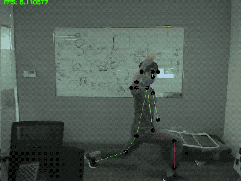

# Capstone Project, M.S. in Internet of Things, UMass Amherst

## Intelligent Trainer

---

### Overview

The architecture for the project is shown in the picture below

### Terminal Device

Below is the demo of the algorithm for real-time trainee pose detection. Using MobileNetv3 on NVIDIA TX2, it can achieve 10 FPS which is enough for daily exercise in ordinary gyms. 



#### Pose Detection Algorithm

##### Algorithm

##### Output Format

The algorithm will give **pixel coordinates** and **detection confidence** of the following key points of human pose


And the output will be given in JSON format like this:

```json
{
    "timestamp": "UNIX timestamp",
    "pose-keypoints":[
        {
            "0":["pixel-x", "pixel-y", "confidence"],
            "1":["pixel-x", "pixel-y", "confidence"],
            "2":["pixel-x", "pixel-y", "confidence"],
            "3":["pixel-x", "pixel-y", "confidence"],
            "4":["pixel-x", "pixel-y", "confidence"],
            "5":["pixel-x", "pixel-y", "confidence"],
            "6":["pixel-x", "pixel-y", "confidence"],
            "7":["pixel-x", "pixel-y", "confidence"],
            "8":["pixel-x", "pixel-y", "confidence"],
            "9":["pixel-x", "pixel-y", "confidence"],
            "0":["pixel-x", "pixel-y", "confidence"],
            "11":["pixel-x", "pixel-y", "confidence"],
            "12":["pixel-x", "pixel-y", "confidence"],
            "13":["pixel-x", "pixel-y", "confidence"],
            "14":["pixel-x", "pixel-y", "confidence"],
            "15":["pixel-x", "pixel-y", "confidence"],
            "16":["pixel-x", "pixel-y", "confidence"],
            "17":["pixel-x", "pixel-y", "confidence"],
            "18":["pixel-x", "pixel-y", "confidence"],
            "19":["pixel-x", "pixel-y", "confidence"],
            "20":["pixel-x", "pixel-y", "confidence"],
            "21":["pixel-x", "pixel-y", "confidence"],
            "22":["pixel-x", "pixel-y", "confidence"],
            "23":["pixel-x", "pixel-y", "confidence"],
            "24":["pixel-x", "pixel-y", "confidence"],
        }
    ]
}
```

#### Pose Comparison

The pose can be compared using the following algorithms:

##### Baseline

1. Normalize the scale of **pixel coordinates** to [-1, 1];
2. Treat the motion of each pose key point as 2D time series and compare it with that of reference motion using <a href="https://en.wikipedia.org/wiki/Dynamic_time_warping">Dynamic Time Wrapping</a>
3. Combine the DWT score of all the key points using weighted average with **detection confidence** as weight

##### Other Methods

TBD