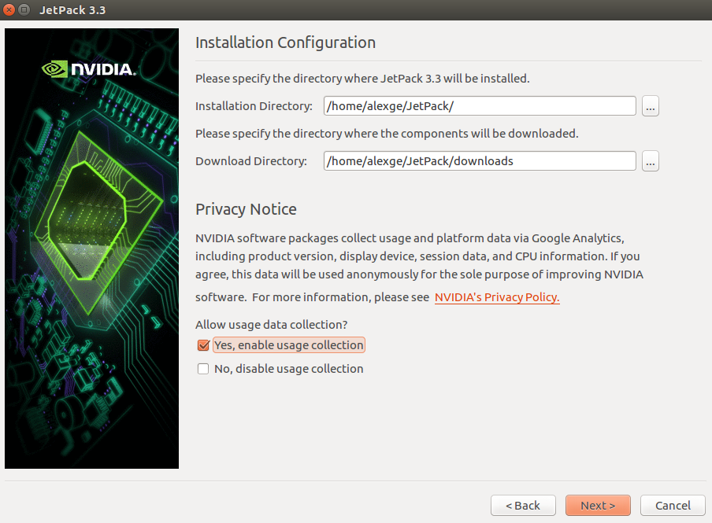
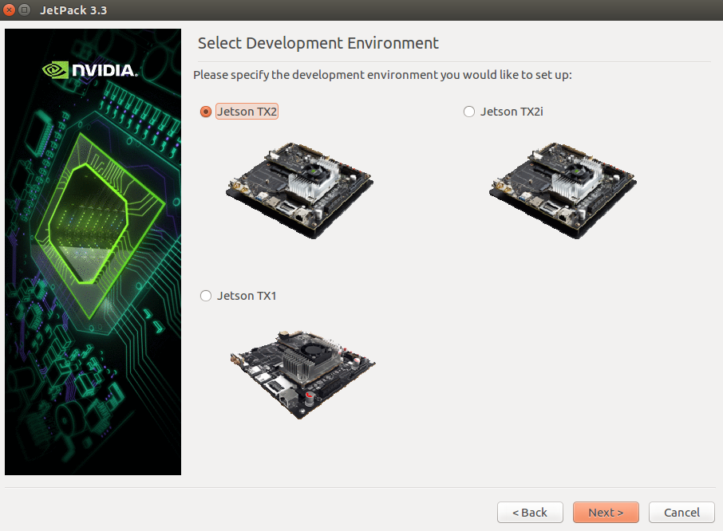
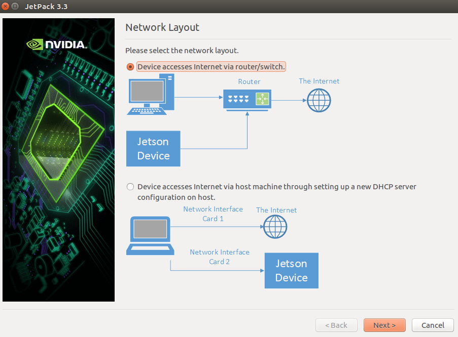
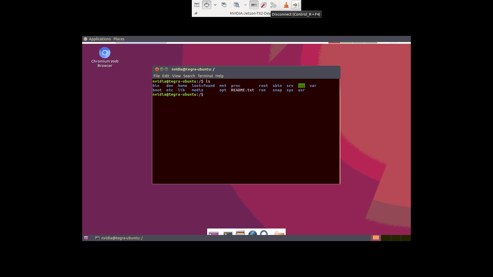
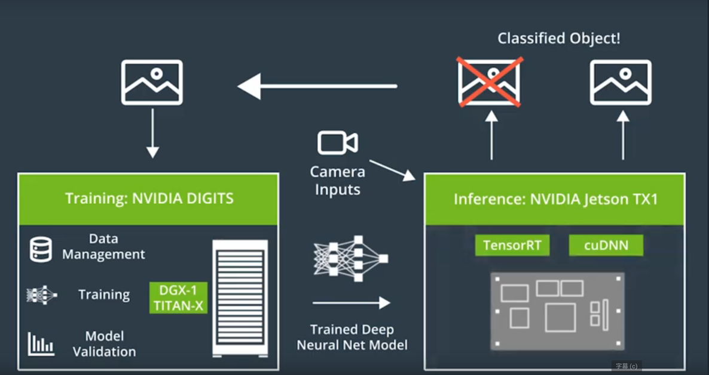

# Capstone Project, M.S. in Internet of Things, UMass Amherst

## Intelligent Trainer -- Terminal Device

---

### Overview

This document covers: 

* The development environment setup on NVIDIA Jetson TX2 board
* The deployment of OpenPose on target board

---

### Board Setup

Download the latest [JetPack](https://developer.nvidia.com/embedded/jetpack) for TXs to the host PC. JetPack is the portal for flashing the Jetson with the latest Board Support Package (BSP). Besides, JetPack also automatically installs tools for the host like CUDA Toolkit. Please select the right release for TX series from download page.

After downloading the script, run the following commands:

```shell
cd <directory where you downloaded JetPack>
chmod +x JetPack-L4T-<version>-linux-x64.run 
./JetPack-L4T-<version>-linux-x64.run
```

First, configure the root directory and download directory as follows:



Then, select target board as *Jetson TX2*:



Select full pacakges as flashing plan, accept all licenses and continue to network layout setup. **Do NOT Use Option 2 if Wi-Fi is used for host Internet access**



Then follow the instructions till successful installation.

After installation, login into target board and save its network addresses for next step host access.

---

### Host Dev Env Setup

#### Coding Env Prep

We use VS Code for Ubuntu as the general IDE. Please download and install it [here](https://code.visualstudio.com/download)

#### Target Board Access

In order to manage target board easily, here we set up remote desktop on it using **VNC**.

**First**, install following packages on target board:

```shell
# 1. update system:
sudo apt-get update && sudo apt-get upgrade
# 2. install graphical user interface utilities:
sudo apt-get install -y ubuntu-desktop gnome-panel gnome-settings-daemon gnome-terminal ubuntu-gnome-desktop metacity nautilus
# 3. install VNC server:
sudo apt install xfce4 xfce4-goodies vnc4server tightvncserver
```

**After that**, set **operation** and **view-only** passwords for VNC server by

```shell
vncserver
```

**Then** proceed to VNC launching configuration. Open the config file:
```shell
vim ~/.vnc/xstartup
```

Copy & paste the following contents inside:
```shell
#!/bin/sh

# Uncomment the following two lines for normal desktop:
# unset SESSION_MANAGER
# exec /etc/X11/xinit/xinitrc

[ -x /etc/vnc/xstartup ] && exec /etc/vnc/xstartup
[ -r $HOME/.Xresources ] && xrdb $HOME/.Xresources
xsetroot -solid grey
startxfce4 &
vncconfig -iconic &
x-terminal-emulator -geometry 80x24+10+10 -ls -title "$VNCDESKTOP Desktop" &
x-window-manager &

gnome-panel &
gnome-settings-daemon &
metacity &
nautilus &
gnome-terminal &
```

Then kill existing instance and restart:
```shell
# 1. kill instance:
vncserver -kill :1
# 2. restart:
vncserver
```

**Finally**, make VNC server part of systemd so that it can start, stop and restart:
```shell
# 1. create config:
sudo vim /etc/systemd/system/vncserver@.service
```

Copy the below config and paste it inside:
```shell
#/etc/systemd/system/vncserver@.service

[Unit]
Description=Start VNC server at startup
After=syslog.target network.target

[Service]
Type=forking
User=nvidia
PAMName=nvidia
PIDFile=/home/nvidia/.vnc/%H:%i.pid
ExecStartPre=/usr/bin/vncserver -kill :%i > /dev/null 2>&1
ExecStart=/usr/bin/vncserver -depth 24 -geometry 1280x800 :%i
ExecStop=/usr/bin/vncserver -kill :%i

[Install]
WantedBy=multi-user.target
```

Then, after creating the SSH tunnel

```shell
# 1. create ssh tunnel:
ssh -L 5901:127.0.0.1:5901 -N -f -l nvidia  <Your target board IP, static or that from LAN DHCP>
# 2. open Remmina
```

The target board can be accessed remotely from host using **Remmina**, the default VNC client of Ubuntu



#### GPU Training Environment

In this project NVIDIA GPU will be accessed through [NVIDIA Docker](https://github.com/NVIDIA/nvidia-docker)

**First**, install NVIDIA drivers for your GPU card:

```shell
# 1. add driver repository to Ubuntu
sudo add-apt-repository ppa:graphics-drivers/ppa
# 2. update packages:
sudo apt update
# 3. install driver:
sudo apt install nvidia-<latest version>
```

**Then**, install Docker following the instructions from [Docker](https://docs.docker.com/install/linux/docker-ce/ubuntu/)

**Finally**, install NVIDIA Docker following the instructions from [NVIDIA Docker](https://github.com/NVIDIA/nvidia-docker)

Run the command below to make sure everything works as planned:

```shell
docker run --runtime=nvidia --rm nvidia/cuda:9.0-base nvidia-smi
```

Fetch the latest NVIDIA DIGITS image to start the development of deep learning applications [NVIDIA DIGITS Docker User Guide]()

```shell
docker run --runtime=nvidia --name digits -d -p 5000:5000 nvidia/digits
```

---

### Model Training and Real-Time Inference



#### Training with DIGITS

In this section model training procedure using NVIDIA DIGITS will be illustrated.

Please follow the tutorials under [Training with DIGITS](tutorials/)

#### Inference on Jetson TX2

In this section model inference procedure on Jetson TX2 will be illustrated.

Please follow the tutorials under [Inference on Jetson TX2](tutorials/)

---