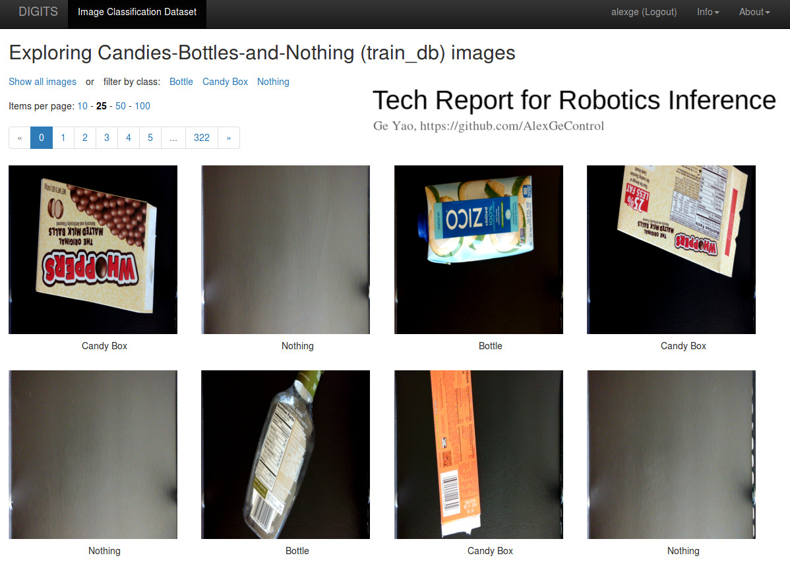
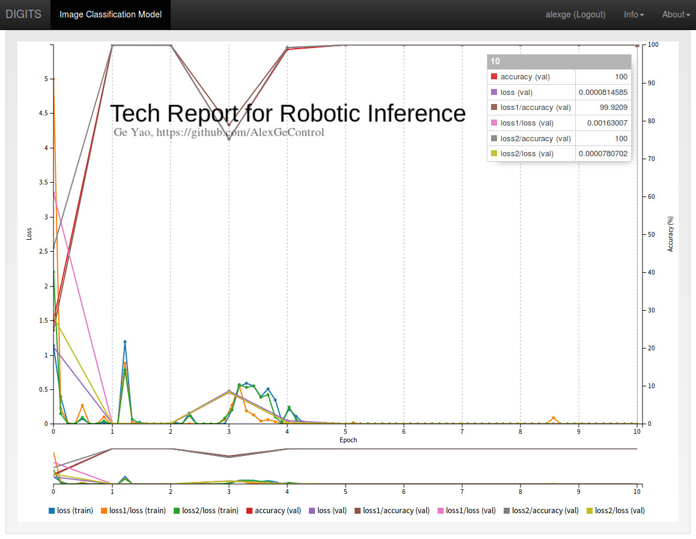
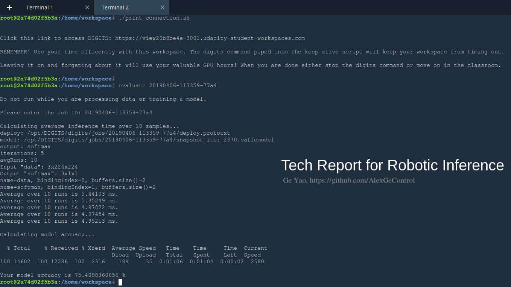

# Robotic Inference

[//]: # (Written by Ge Yao, 6th, April, 2019)

This project consists of two tasks. The first one builds an desktop scenario classification network using NVIDIA DIGITS workflow. The second one trains a hand-written Tibetan digits recognizer on collected data from Minzu University of China(Central Ethnics University of China).

---

## Solution

### Dataset

Data is provided by Udacity inside its hosted cloud development environment. It contains three kinds of desktop scenarios:

* With Candy
* With Bottle
* With Nothing

Sample images from the dataset are as follows:

### Network Architecture

For this solution GoogLeNet is used in order to strike a balance between model competence and inference time. **Adam** optimizer with initial learning rate at **0.01** is used for **10** epochs.

The training curves are visualized below. 

The trained model can be found [here](models/on-supplied-data).

### Inference

After training, the attained network's inference time will be evaluated on the following two metrics:

* mean inference time on 10 samples repeated for 5 times
* classification accuracy on test set

The results are as follows:

---

### Results

Model inference speed and average accuracy are listed below again for easy reference:

* Mean Inference Speed: 5.13968 ms
* Mean Classification Accuracy: 75.40984%

---

## Utilities:

[Watermark Service](https://www.watermarquee.com/)
[Online LaTeX Template](https://www.overleaf.com/read/ghypqqdcrjsv)